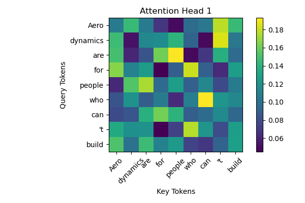

# Understanding Transformer

## To Start With
 The Transformer has revolutionized Natural Language Processing, ushering in dramatic changes not only in artificial intelligence but also in search engines, essay writing, and beyond. I've taken full advantage of this breakthrough—building GPT-2 from scratch and even attempting to pretrain BERT. Yet, a thought struck me: I know how to use these powerful tools, but I haven’t truly grasped the essence of artificial intelligence. That’s why I decided to visualize the core computations of the Transformer.

## Single head attention
 The Transformer concept has root on the paper `Attention is all you need`. They implemented the attention mechanism to NLP process and changed the game. Key idea is following:<br>
$$
\text{Attention}(Q, K, V) = \text{softmax}\left(\frac{QK^\top}{\sqrt{d_k}}\right)V
$$



<br>
Bert is a stack of Encoder Layer and GPT is a stack of Decoder layer. I knew how to make Encoder layer using Multihead-SelfAttention Layer and MultiLayer Perceptron but, not about Decoder layer. When I saw that image from `Attention is all you need`, I had a instinct that I can make the decoder layer. One thing added was Masked Multihead-SelfAttention layer. Before, let's talk about Tokenization and Preprocessing.<br>

## Tokenization
Tokenization is crutial for the LLM. LLM, a large language model doesn't actually *read* or *understand* the context of sentences. Humans read the line just by looking at the sentence level. Actually, human don't look all the words inside the sentence. **You assume what inner word will be.** On the other hand, computers looks at the words. You can learn by Computer Vision sector for example making CNN or ViT. AI model breaks image into smaller patch of images and analyzes the RGB value. In the same way, sentence needs to be patched, we call it tokenization.<br>
I've used `KR-Bert Tokenizer` and `Kkma` to tokenize the korean sentence. `Kkma` is a tool that cuts the sentence into smaller morpheme. Korean morpheme is more complex than that of English or other words. Also, I've tested with just using `KR-Bert Tokenizer` and using both and got 1%~2% better quality. <br>
Code is like following:
```python
import torch
from konlpy.tag import Kkma
from transformers import AutoTokenizer
import os
import json

# Initialize kkma for morphological analysis and KoBERT tokenizer
kkma = Kkma()
krbert_tokenizer = AutoTokenizer.from_pretrained("snunlp/KR-Medium", do_lower_case=False)

# Parameters
max_seq_len = 256
stride = 128
input_dir = "C:/junha/Git_Clone/LLM_Classifier/data/training/korean"
output_dir = "C:/junha/Git_Clone/LLM_Classifier/data/training/korean_tokenized"

# Create output directory if it doesn't exist
os.makedirs(output_dir, exist_ok=True)

# Function for sliding window tokenization
def tokenize_with_sliding_window(text: str):
    # Perform morphological analysis
    morphemes = kkma.morphs(text)
    processed_text = ' '.join(morphemes)

    # Tokenize with max length limit of 512 to avoid indexing errors
    tokens = krbert_tokenizer(processed_text, return_tensors="pt", padding='longest', truncation=True, max_length=512)
    input_ids = tokens['input_ids'].squeeze(0)
    attention_mask = tokens['attention_mask'].squeeze(0)

    tokenized_windows = []
    num_windows = (len(input_ids) - max_seq_len + stride) // stride + 1
    for i in range(num_windows):
        start = i * stride
        end = start + max_seq_len
        input_ids_window = input_ids[start:end]
        attention_mask_window = attention_mask[start:end]

        # If the window is shorter than max_seq_len, pad it
        if len(input_ids_window) < max_seq_len:
            padding_length = max_seq_len - len(input_ids_window)
            input_ids_window = torch.cat([input_ids_window, torch.zeros(padding_length, dtype=torch.long)])
            attention_mask_window = torch.cat([attention_mask_window, torch.zeros(padding_length, dtype=torch.long)])

        tokenized_windows.append({'input_ids': input_ids_window, 'attention_mask': attention_mask_window})

    return tokenized_windows

# Process each JSON file in the input directory
for filename in os.listdir(input_dir):
    if filename.endswith(".json"):
        filepath = os.path.join(input_dir, filename)

        # Read the content of the JSON file
        with open(filepath, 'r', encoding='utf-8') as file:
            data = json.load(file)

        # Extract the "passage" value if it exists
        if "passage" in data:
            text = data["passage"]

            # Tokenize the text with sliding window
            tokenized_windows = tokenize_with_sliding_window(text)

            # Save each window with a unique name based on window index
            for i, window in enumerate(tokenized_windows):
                output_path = os.path.join(output_dir, f"{os.path.splitext(filename)[0]}_window_{i}.pt")
                torch.save(window, output_path)

print("All files have been tokenized and saved with sliding windows.")
```
<br>
The result is `pt` file. It can be read on torch environment. And there are a bunch of `pt` files inside directory. I have about 140,000 Korean article data from AI Hub and when tokenized, it multiplied to about 400,000. First, I trained with 20,000 pt files.

# Results, I guess?
## This part was all about tokenizing the data.

